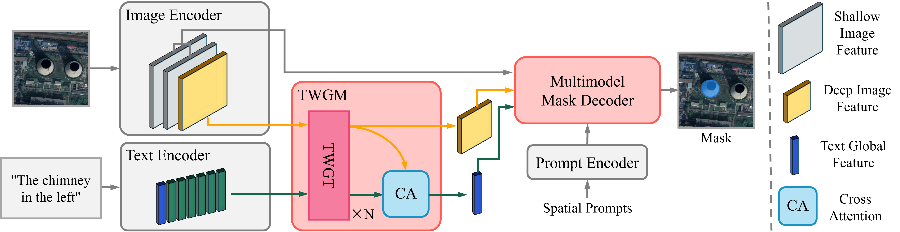

# RSAM: Vision-Language Two-Way Guidance for Referring Remote Sensing Image Segmentation




This repository contains the official implementation and datasets for the paper "RSAM: Vision-Language Two-Way Guidance for Referring Remote Sensing Image Segmentation".

## Installation

RSAM needs to be installed first before use. The code requires `python>=3.12`, as well as `torch>=2.6.0` and `torchvision>=0.21.0`. Please follow the instructions [here](https://pytorch.org/get-started/locally/) to install both PyTorch and TorchVision dependencies. You can install RSAM on a GPU machine using:

```bash
git clone https://github.com/zhaozlcc/rsam.git && cd rsam
pip install -e .
```

## Getting Started

### Structure
```
rsam/
├── checkpoints                     # Model checkpoints
│   ├── bert-base.bin               # bert_base_uncase
│   └── sam2.1_hiera_base_plus.pt   # hiera_base_plus
├── data/                           # Data directory
│   └── RISORS/                     
│       ├── Annotations/            
│       ├── JPEGImages/            
│       ├── RISORS_test.txt       
│       ├── RISORS_train.txt       
│       └── RISORS_val.txt     
├── rsam/                           # Source code
│   ├── config/                     # Model and Training config files
│   ├── csrc/                       # CUDA code
│   ├── modeling/                   # Model code
│   └── utils/                      # Utility functions
├── training/                       # Train script
├── LICENSE                         # License file
└── README.md                       # This file
```

### Download Checkpoints
- [sam2.1_hiera_base_plus.pt](https://dl.fbaipublicfiles.com/segment_anything_2/092824/sam2.1_hiera_base_plus.pt)
- [bert_base.pt](https://huggingface.co/google-bert/bert-base-uncased/tree/main)

### Dataset

[RISORS](https://huggingface.co/datasets/zhaozlcc/RISORS/tree/main)


### Train

```python
python training/train.py -c ./configs/rsam_b+_b.yaml --num-gpus 4
```


## Paper
The paper is now avaliable on [Remote Sensing](https://www.mdpi.com/2072-4292/17/24/3960).

### Citation

If you find this work valuable or use our code in your own research, please consider citing us with the following bibtex:

```bibtex
@Article{zhao2025rsam,
    AUTHOR = {Zhao, Zilong and Xu, Xin and Huang, Bingxin and Chen, Hongjia and Pu, Fangling},
    TITLE = {RSAM: Vision-Language Two-Way Guidance for Referring Remote Sensing Image Segmentation},
    JOURNAL = {Remote Sensing},
    VOLUME = {17},
    YEAR = {2025},
    NUMBER = {24},
    ARTICLE-NUMBER = {3960},
    URL = {https://www.mdpi.com/2072-4292/17/24/3960},
    ISSN = {2072-4292},
    DOI = {10.3390/rs17243960}
}
```


## Contact

Zhao Zilong: whuzhaozilong@whu.edu.cn

## Acknowledgements
Code in this repository is built on [SAM 2](https://github.com/facebookresearch/sam2). We'd like to thank the authors for open sourcing their project.